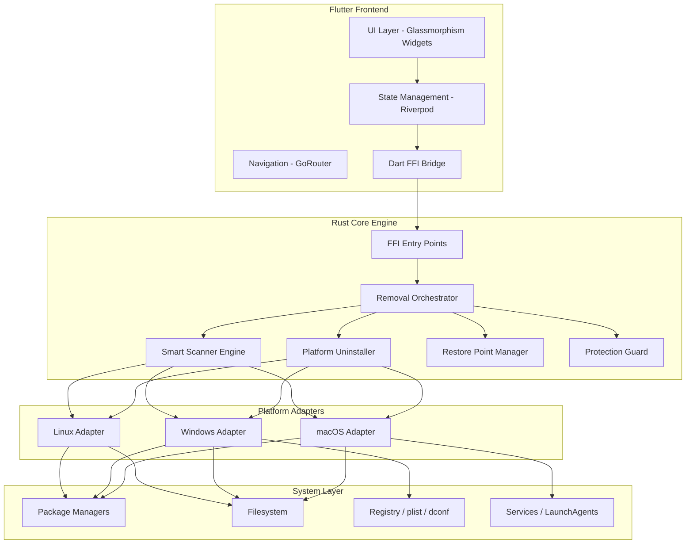
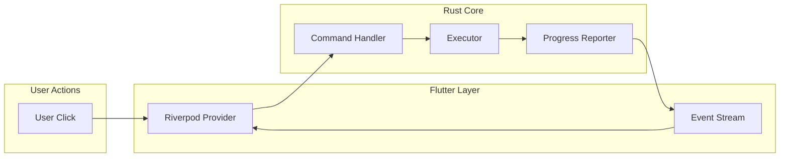
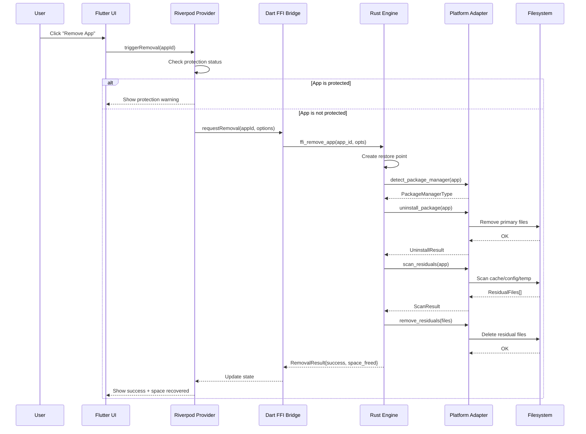
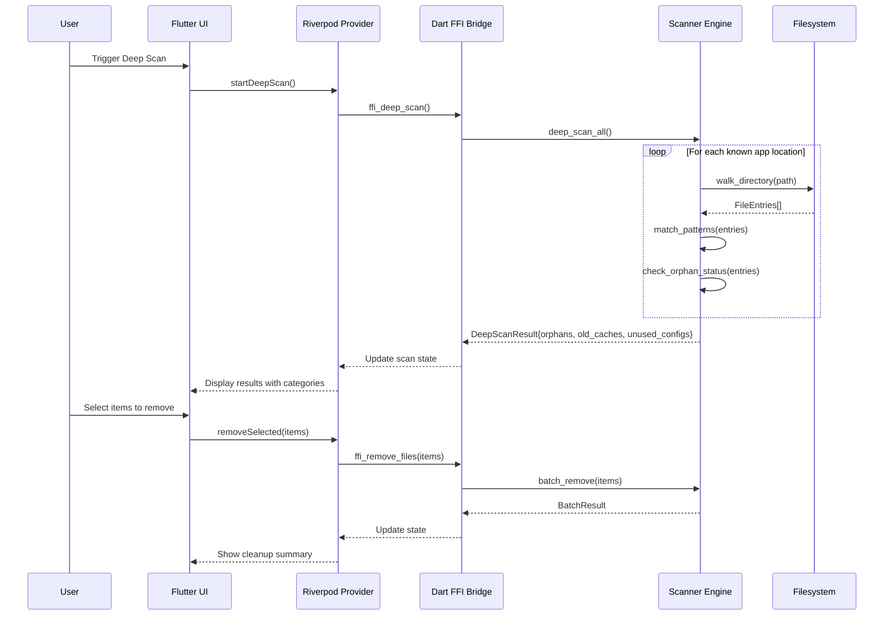
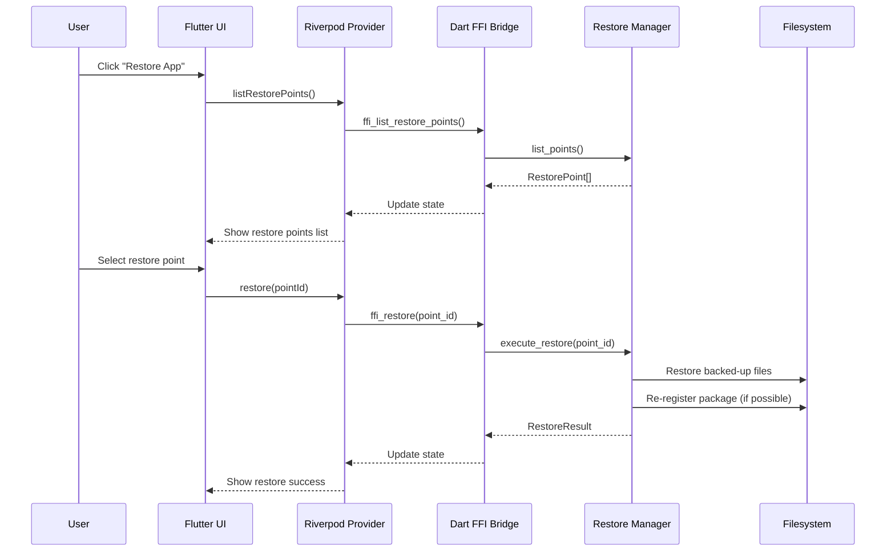

# Design Document: GhostB — Universal Smart App Remover

## Overview

GhostB is a modern cross-platform desktop application built with Flutter that provides complete application removal across Linux, Windows, and macOS. Unlike basic uninstallers, GhostB performs deep scanning to identify and remove all residual files including caches, hidden configurations, orphan dependencies, startup services, and temporary data — achieving true "ghost-level" cleanup with a single click.

The application follows a layered architecture where a Flutter/Dart frontend communicates with a Rust-based native core engine via FFI (Foreign Function Interface). The Rust backend handles all privileged system operations (package manager interactions, filesystem scanning, registry manipulation) while the Flutter layer provides a beautiful, Apple-inspired glassmorphism UI with smooth animations and real-time progress feedback. A platform abstraction layer ensures each OS's package managers and file conventions are handled through a unified interface.

The design prioritizes safety through a Protected Apps system, Restore Points for rollback capability, and a tiered permission model that prevents accidental deletion of critical system components.

## Architecture

### System Overview



### Data Flow Architecture




## Sequence Diagrams

### One-Click Full Removal Flow



### Deep Scan Flow



### Restore Point Flow



## Components and Interfaces

### Component 1: Flutter UI Layer

**Purpose**: Renders the glassmorphism-inspired interface, handles user interactions, and displays real-time feedback from the native engine.

**Interface**:
```dart
// Core screen contracts
abstract class GhostBScreen {
  String get routePath;
  String get title;
  Widget build(BuildContext context, WidgetRef ref);
}

// Main app shell
abstract class AppShell {
  Widget buildSidebar(BuildContext context);
  Widget buildContent(BuildContext context);
  Widget buildStatusBar(BuildContext context);
}
```

**Responsibilities**:
- Render translucent panels with blur effects (glassmorphism)
- Display app list with categories and search
- Show scan progress with animations
- Present removal confirmations and results
- Manage dark/light theme switching

### Component 2: State Management Layer (Riverpod)

**Purpose**: Manages application state, coordinates between UI and FFI bridge, handles async operations and caching.

**Interface**:
```dart
// Core providers interface
abstract class AppListNotifier extends AsyncNotifier<List<InstalledApp>> {
  Future<void> refresh();
  Future<void> removeApp(String appId, RemovalOptions options);
  Future<void> protectApp(String appId);
  Future<void> unprotectApp(String appId);
}

abstract class ScanNotifier extends AsyncNotifier<ScanState> {
  Future<void> startQuickScan();
  Future<void> startDeepScan();
  Future<void> cancelScan();
  Stream<ScanProgress> get progressStream;
}

abstract class RestoreNotifier extends AsyncNotifier<List<RestorePoint>> {
  Future<void> createRestorePoint(String appId);
  Future<void> restore(String pointId);
  Future<void> deleteRestorePoint(String pointId);
}
```

**Responsibilities**:
- Cache installed app list with invalidation
- Manage scan state and progress
- Handle removal queue and concurrent operations
- Persist user preferences (protected apps, settings)

### Component 3: FFI Bridge

**Purpose**: Provides type-safe Dart bindings to the Rust core engine, handles serialization/deserialization, and manages native memory.

**Interface**:
```dart
abstract class NativeBridge {
  Future<List<NativeApp>> listInstalledApps();
  Future<RemovalResult> removeApp(String appId, RemovalOptions options);
  Future<ScanResult> scanResiduals(String appId);
  Future<DeepScanResult> deepScan();
  Future<String> createRestorePoint(String appId);
  Future<RestoreResult> restore(String pointId);
  Stream<ProgressEvent> get progressStream;
  void dispose();
}
```

**Responsibilities**:
- Marshal Dart objects to C-compatible structs
- Handle async callbacks from Rust via isolates
- Manage native memory lifecycle (allocation/deallocation)
- Provide error translation from Rust panics to Dart exceptions

### Component 4: Rust Core Engine

**Purpose**: Executes all system-level operations including package detection, uninstallation, filesystem scanning, and restore point management.

**Interface**:
```rust
// Public FFI entry points
pub trait CoreEngine {
    fn list_installed_apps(&self) -> Result<Vec<AppInfo>, EngineError>;
    fn remove_app(&self, app_id: &str, opts: &RemovalOptions) -> Result<RemovalResult, EngineError>;
    fn scan_residuals(&self, app_id: &str) -> Result<ScanResult, EngineError>;
    fn deep_scan(&self) -> Result<DeepScanResult, EngineError>;
    fn create_restore_point(&self, app_id: &str) -> Result<String, EngineError>;
    fn restore(&self, point_id: &str) -> Result<RestoreResult, EngineError>;
}
```

**Responsibilities**:
- Detect installed applications across all package managers
- Execute safe uninstallation with rollback capability
- Perform filesystem scanning with pattern matching
- Manage restore point storage and retrieval
- Enforce protection rules

### Component 5: Platform Adapters

**Purpose**: Abstract OS-specific operations behind a unified interface, allowing the core engine to operate platform-agnostically.

**Interface**:
```rust
pub trait PlatformAdapter: Send + Sync {
    fn detect_apps(&self) -> Result<Vec<AppInfo>, AdapterError>;
    fn uninstall(&self, app: &AppInfo) -> Result<UninstallResult, AdapterError>;
    fn find_residuals(&self, app: &AppInfo) -> Result<Vec<ResidualFile>, AdapterError>;
    fn remove_files(&self, files: &[ResidualFile]) -> Result<BatchRemoveResult, AdapterError>;
    fn get_app_size(&self, app: &AppInfo) -> Result<u64, AdapterError>;
    fn platform_name(&self) -> &str;
}
```

**Responsibilities**:
- Linux: Interface with APT, Snap, Flatpak, Pacman, RPM, DNF, AppImage detection
- Windows: Query registry, interact with Winget/Chocolatey/Scoop, handle MSI
- macOS: Parse .app bundles, interface with Homebrew/MacPorts, scan Library paths


## Data Models

### InstalledApp

```dart
@freezed
class InstalledApp with _$InstalledApp {
  const factory InstalledApp({
    required String id,
    required String name,
    required String version,
    required AppCategory category,
    required PackageManagerType packageManager,
    required String installPath,
    required int sizeBytes,
    required DateTime installDate,
    required bool isProtected,
    required bool isSystemApp,
    String? iconPath,
    String? publisher,
    List<String>? associatedFiles,
  }) = _InstalledApp;
}

enum AppCategory {
  system,
  development,
  games,
  utilities,
  multimedia,
  internet,
  office,
  unknown,
}

enum PackageManagerType {
  // Linux
  apt, snap, flatpak, appImage, pacman, rpm, dnf, yum, tarBased,
  // Windows
  registry, winget, chocolatey, scoop, msi, portable,
  // macOS
  appBundle, homebrew, macPorts,
}
```

**Validation Rules**:
- `id` must be unique across all detected apps
- `name` must be non-empty
- `sizeBytes` must be >= 0
- `installPath` must exist on filesystem at detection time
- `isSystemApp` determined by install location and package metadata

### RemovalOptions

```dart
@freezed
class RemovalOptions with _$RemovalOptions {
  const factory RemovalOptions({
    @Default(true) bool removeCache,
    @Default(true) bool removeConfig,
    @Default(true) bool removeData,
    @Default(true) bool removeLogs,
    @Default(true) bool removeOrphanDeps,
    @Default(false) bool removeSharedDeps,
    @Default(true) bool createRestorePoint,
    @Default(false) bool ghostMode,
    @Default(false) bool forceRemove,
  }) = _RemovalOptions;
}
```

### ScanResult

```dart
@freezed
class ScanResult with _$ScanResult {
  const factory ScanResult({
    required String appId,
    required List<ResidualFile> residuals,
    required int totalSizeBytes,
    required Duration scanDuration,
    required ScanDepth depth,
  }) = _ScanResult;
}

@freezed
class ResidualFile with _$ResidualFile {
  const factory ResidualFile({
    required String path,
    required int sizeBytes,
    required ResidualType type,
    required RiskLevel riskLevel,
    required DateTime lastModified,
    String? associatedApp,
  }) = _ResidualFile;
}

enum ResidualType {
  cache,
  config,
  data,
  log,
  temp,
  orphanDependency,
  startupEntry,
  service,
  registryKey,
  hiddenFolder,
}

enum RiskLevel { safe, moderate, dangerous }
enum ScanDepth { quick, standard, deep }
```

### RestorePoint

```dart
@freezed
class RestorePoint with _$RestorePoint {
  const factory RestorePoint({
    required String id,
    required String appId,
    required String appName,
    required DateTime createdAt,
    required int sizeBytes,
    required List<BackedUpFile> files,
    required Map<String, dynamic> metadata,
    String? packageManagerState,
  }) = _RestorePoint;
}

@freezed
class BackedUpFile with _$BackedUpFile {
  const factory BackedUpFile({
    required String originalPath,
    required String backupPath,
    required int sizeBytes,
    required String checksum,
  }) = _BackedUpFile;
}
```

### Rust-side Data Models

```rust
#[derive(Debug, Clone, Serialize, Deserialize)]
pub struct AppInfo {
    pub id: String,
    pub name: String,
    pub version: String,
    pub category: AppCategory,
    pub package_manager: PackageManagerType,
    pub install_path: PathBuf,
    pub size_bytes: u64,
    pub install_date: DateTime<Utc>,
    pub is_protected: bool,
    pub is_system_app: bool,
    pub icon_path: Option<PathBuf>,
    pub publisher: Option<String>,
    pub associated_files: Vec<PathBuf>,
}

#[derive(Debug, Clone, Serialize, Deserialize)]
pub struct RemovalResult {
    pub app_id: String,
    pub success: bool,
    pub files_removed: u32,
    pub space_freed_bytes: u64,
    pub errors: Vec<RemovalError>,
    pub restore_point_id: Option<String>,
    pub duration_ms: u64,
}

#[derive(Debug, Clone, Serialize, Deserialize)]
pub struct ScanPattern {
    pub base_paths: Vec<PathBuf>,
    pub glob_patterns: Vec<String>,
    pub exclusions: Vec<String>,
    pub max_depth: u32,
}
```


## Algorithmic Pseudocode

### Smart Residual Scanner Algorithm

```pascal
ALGORITHM smartResidualScan(app)
INPUT: app of type AppInfo
OUTPUT: result of type ScanResult

BEGIN
  ASSERT app.id IS NOT EMPTY
  ASSERT app.install_path EXISTS ON FILESYSTEM

  residuals ← EMPTY LIST
  patterns ← getPlatformPatterns(app)
  
  // Phase 1: Known location scan
  FOR EACH base_path IN patterns.base_paths DO
    ASSERT base_path IS VALID PATH
    
    IF base_path EXISTS THEN
      entries ← walkDirectory(base_path, patterns.max_depth)
      
      FOR EACH entry IN entries DO
        IF matchesAppSignature(entry, app) THEN
          residual ← classifyResidual(entry, app)
          residuals.ADD(residual)
        END IF
      END FOR
    END IF
  END FOR

  // Phase 2: Pattern-based scan (glob matching)
  FOR EACH pattern IN patterns.glob_patterns DO
    matches ← globSearch(pattern)
    
    FOR EACH match IN matches DO
      IF NOT isExcluded(match, patterns.exclusions) THEN
        IF matchesAppSignature(match, app) THEN
          residual ← classifyResidual(match, app)
          IF residual NOT IN residuals THEN
            residuals.ADD(residual)
          END IF
        END IF
      END IF
    END FOR
  END FOR

  // Phase 3: Orphan dependency detection
  orphans ← detectOrphanDependencies(app)
  FOR EACH orphan IN orphans DO
    residuals.ADD(createResidual(orphan, ResidualType.ORPHAN_DEPENDENCY))
  END FOR

  totalSize ← SUM(residual.size_bytes FOR residual IN residuals)
  
  ASSERT ALL residuals HAVE valid paths
  ASSERT totalSize >= 0
  
  RETURN ScanResult(app.id, residuals, totalSize, elapsed, depth)
END
```

**Preconditions:**
- `app` is a valid, previously-detected installed application
- `app.install_path` exists or existed on the filesystem
- Platform adapter is initialized for current OS

**Postconditions:**
- Returns a complete list of all detected residual files
- Each residual has a valid path, size, type, and risk level
- No system-critical files are included in results
- Total size equals sum of individual residual sizes

**Loop Invariants:**
- All previously scanned entries have been classified
- No duplicate paths exist in the residuals list
- Excluded paths are never added to results

### Platform Pattern Resolution Algorithm

```pascal
ALGORITHM getPlatformPatterns(app)
INPUT: app of type AppInfo
OUTPUT: patterns of type ScanPattern

BEGIN
  platform ← detectCurrentPlatform()
  app_name_lower ← LOWERCASE(app.name)
  app_id_variants ← generateIdVariants(app)
  
  CASE platform OF
    LINUX:
      base_paths ← [
        HOME + "/.config/" + app_name_lower,
        HOME + "/.local/share/" + app_name_lower,
        HOME + "/.cache/" + app_name_lower,
        "/tmp/" + app_name_lower + "*",
        HOME + "/.local/lib/" + app_name_lower,
        "/var/log/" + app_name_lower,
        HOME + "/." + app_name_lower
      ]
      
      FOR EACH variant IN app_id_variants DO
        base_paths.ADD(HOME + "/.config/" + variant)
        base_paths.ADD(HOME + "/.local/share/" + variant)
        base_paths.ADD(HOME + "/.cache/" + variant)
      END FOR
      
      glob_patterns ← [
        HOME + "/.config/**/*" + app_name_lower + "*",
        HOME + "/.local/**/*" + app_name_lower + "*",
        "/etc/" + app_name_lower + "*",
        HOME + "/.*" + app_name_lower + "*"
      ]
      
      exclusions ← ["/proc", "/sys", "/dev", HOME + "/.config/systemd"]
      
    WINDOWS:
      base_paths ← [
        APPDATA + "\\" + app.name,
        LOCAL_APPDATA + "\\" + app.name,
        PROGRAMDATA + "\\" + app.name,
        TEMP + "\\" + app_name_lower + "*",
        HOME + "\\AppData\\Local\\Temp\\" + app_name_lower
      ]
      
      glob_patterns ← [
        APPDATA + "\\**\\*" + app_name_lower + "*",
        LOCAL_APPDATA + "\\**\\*" + app_name_lower + "*"
      ]
      
      exclusions ← ["\\Windows\\System32", "\\Windows\\WinSxS"]
      
    MACOS:
      base_paths ← [
        HOME + "/Library/Caches/" + app.name,
        HOME + "/Library/Preferences/" + app.id + ".plist",
        HOME + "/Library/Application Support/" + app.name,
        HOME + "/Library/Logs/" + app.name,
        HOME + "/Library/LaunchAgents/" + app.id + "*.plist",
        HOME + "/Library/Saved Application State/" + app.id + ".savedState",
        "/Library/LaunchDaemons/" + app.id + "*.plist"
      ]
      
      glob_patterns ← [
        HOME + "/Library/**/*" + app_name_lower + "*",
        "/Library/**/*" + app_name_lower + "*"
      ]
      
      exclusions ← ["/System", "/Library/Apple"]
  END CASE
  
  RETURN ScanPattern(base_paths, glob_patterns, exclusions, max_depth: 5)
END
```

### Uninstallation Orchestration Algorithm

```pascal
ALGORITHM orchestrateRemoval(app, options)
INPUT: app of type AppInfo, options of type RemovalOptions
OUTPUT: result of type RemovalResult

BEGIN
  ASSERT app IS NOT NULL
  ASSERT NOT app.is_protected OR options.force_remove
  
  // Step 1: Safety checks
  IF app.is_system_app AND NOT options.force_remove THEN
    RETURN RemovalResult(success: false, error: "System app requires force mode")
  END IF
  
  // Step 2: Create restore point (if enabled)
  restore_point_id ← NULL
  IF options.create_restore_point THEN
    restore_point_id ← createRestorePoint(app)
    ASSERT restore_point_id IS NOT NULL
  END IF
  
  // Step 3: Uninstall via package manager
  uninstall_result ← platformAdapter.uninstall(app)
  
  IF NOT uninstall_result.success THEN
    IF restore_point_id IS NOT NULL THEN
      rollback(restore_point_id)
    END IF
    RETURN RemovalResult(success: false, error: uninstall_result.error)
  END IF
  
  // Step 4: Scan and remove residuals
  files_removed ← 0
  space_freed ← 0
  errors ← EMPTY LIST
  
  IF options.remove_cache OR options.remove_config OR options.remove_data THEN
    scan_result ← smartResidualScan(app)
    
    FOR EACH residual IN scan_result.residuals DO
      should_remove ← FALSE
      
      CASE residual.type OF
        CACHE: should_remove ← options.remove_cache
        CONFIG: should_remove ← options.remove_config
        DATA: should_remove ← options.remove_data
        LOG: should_remove ← options.remove_logs
        ORPHAN_DEPENDENCY: should_remove ← options.remove_orphan_deps
        TEMP: should_remove ← TRUE
        STARTUP_ENTRY: should_remove ← TRUE
        SERVICE: should_remove ← TRUE
      END CASE
      
      IF should_remove THEN
        remove_result ← safeRemove(residual.path)
        IF remove_result.success THEN
          files_removed ← files_removed + 1
          space_freed ← space_freed + residual.size_bytes
        ELSE
          errors.ADD(remove_result.error)
        END IF
      END IF
    END FOR
  END IF
  
  ASSERT files_removed >= 0
  ASSERT space_freed >= 0
  
  RETURN RemovalResult(
    app_id: app.id,
    success: TRUE,
    files_removed: files_removed,
    space_freed_bytes: space_freed,
    errors: errors,
    restore_point_id: restore_point_id
  )
END
```

**Preconditions:**
- `app` exists in the installed apps registry
- If `app.is_protected`, then `options.force_remove` must be true
- Platform adapter is initialized and has required permissions
- Sufficient disk space for restore point (if enabled)

**Postconditions:**
- If success: all requested file types are removed
- If failure: restore point is used to rollback (if created)
- `files_removed` accurately counts deleted files
- `space_freed_bytes` accurately reflects reclaimed disk space
- No protected system files are removed unless force mode

**Loop Invariants:**
- `files_removed` monotonically increases
- `space_freed` monotonically increases
- Each residual is processed exactly once


## Key Functions with Formal Specifications

### Dart FFI Bridge

```dart
/// Native bridge implementation using dart:ffi
class RustBridge implements NativeBridge {
  late final DynamicLibrary _lib;
  late final StreamController<ProgressEvent> _progressController;

  RustBridge() {
    _lib = _loadLibrary();
    _progressController = StreamController<ProgressEvent>.broadcast();
    _initializeCallbacks();
  }

  DynamicLibrary _loadLibrary() {
    if (Platform.isLinux) return DynamicLibrary.open('libghostb_core.so');
    if (Platform.isWindows) return DynamicLibrary.open('ghostb_core.dll');
    if (Platform.isMacOS) return DynamicLibrary.open('libghostb_core.dylib');
    throw UnsupportedError('Platform not supported');
  }
}
```

**Preconditions:**
- Native library binary exists at expected path for current platform
- Library is compiled for current architecture (x86_64 / arm64)

**Postconditions:**
- `_lib` is a valid handle to the native library
- `_progressController` is ready to emit events
- All FFI function pointers are resolved

### Function: listInstalledApps()

```dart
@override
Future<List<NativeApp>> listInstalledApps() async {
  return Isolate.run(() {
    final ffiListApps = _lib.lookupFunction<
      Pointer<Utf8> Function(),
      Pointer<Utf8> Function()
    >('ghostb_list_apps');

    final resultPtr = ffiListApps();
    final jsonString = resultPtr.toDartString();
    _freeString(resultPtr);

    final List<dynamic> decoded = jsonDecode(jsonString);
    return decoded.map((e) => NativeApp.fromJson(e)).toList();
  });
}
```

**Preconditions:**
- Native library is loaded and `ghostb_list_apps` symbol exists
- System has read permissions for package manager databases

**Postconditions:**
- Returns complete list of all detected apps across all package managers
- Each app has a unique `id`
- Memory allocated by Rust is properly freed
- No memory leaks from FFI boundary

**Loop Invariants:** N/A

### Function: removeApp()

```dart
@override
Future<RemovalResult> removeApp(String appId, RemovalOptions options) async {
  return Isolate.run(() {
    final ffiRemoveApp = _lib.lookupFunction<
      Pointer<Utf8> Function(Pointer<Utf8>, Pointer<Utf8>),
      Pointer<Utf8> Function(Pointer<Utf8>, Pointer<Utf8>)
    >('ghostb_remove_app');

    final appIdPtr = appId.toNativeUtf8();
    final optionsJson = jsonEncode(options.toJson()).toNativeUtf8();

    final resultPtr = ffiRemoveApp(appIdPtr, optionsJson);
    final resultJson = resultPtr.toDartString();

    malloc.free(appIdPtr);
    malloc.free(optionsJson);
    _freeString(resultPtr);

    return RemovalResult.fromJson(jsonDecode(resultJson));
  });
}
```

**Preconditions:**
- `appId` corresponds to a valid installed application
- `options` is well-formed
- Application is not protected (unless `forceRemove` is true)
- Sufficient permissions for uninstallation

**Postconditions:**
- If success: app is fully removed per options
- If failure: error details in result, restore point available for rollback
- All native memory is freed
- Progress events emitted during operation

### Rust FFI Entry Points

```rust
/// List all installed applications - FFI entry point
#[no_mangle]
pub extern "C" fn ghostb_list_apps() -> *mut c_char {
    let result = std::panic::catch_unwind(|| {
        let engine = CoreEngineImpl::new();
        let apps = engine.list_installed_apps();
        match apps {
            Ok(apps) => serde_json::to_string(&apps).unwrap_or_default(),
            Err(e) => serde_json::to_string(&ErrorResponse::from(e)).unwrap_or_default(),
        }
    });

    match result {
        Ok(json) => CString::new(json).unwrap().into_raw(),
        Err(_) => CString::new("[]").unwrap().into_raw(),
    }
}

/// Remove an application - FFI entry point
#[no_mangle]
pub extern "C" fn ghostb_remove_app(
    app_id: *const c_char,
    options_json: *const c_char,
) -> *mut c_char {
    let app_id = unsafe { CStr::from_ptr(app_id).to_string_lossy().to_string() };
    let options_str = unsafe { CStr::from_ptr(options_json).to_string_lossy().to_string() };

    let result = std::panic::catch_unwind(|| {
        let options: RemovalOptions = serde_json::from_str(&options_str)
            .unwrap_or_default();
        let engine = CoreEngineImpl::new();
        let result = engine.remove_app(&app_id, &options);
        serde_json::to_string(&result).unwrap_or_default()
    });

    match result {
        Ok(json) => CString::new(json).unwrap().into_raw(),
        Err(_) => CString::new(r#"{"success":false,"error":"panic"}"#).unwrap().into_raw(),
    }
}

/// Free a string allocated by Rust - called from Dart
#[no_mangle]
pub extern "C" fn ghostb_free_string(ptr: *mut c_char) {
    if !ptr.is_null() {
        unsafe { drop(CString::from_raw(ptr)); }
    }
}
```

**Preconditions:**
- Pointers are valid, non-null C strings (UTF-8 encoded)
- JSON payloads conform to expected schema

**Postconditions:**
- Returns valid C string pointer (caller must free via `ghostb_free_string`)
- Panics are caught and converted to error JSON
- No undefined behavior from null pointer dereference

### Riverpod Providers

```dart
/// Main app list provider with auto-refresh
@riverpod
class AppList extends _$AppList {
  @override
  Future<List<InstalledApp>> build() async {
    final bridge = ref.watch(nativeBridgeProvider);
    final nativeApps = await bridge.listInstalledApps();
    final protectedIds = await ref.watch(protectedAppsProvider.future);

    return nativeApps.map((native) => InstalledApp(
      id: native.id,
      name: native.name,
      version: native.version,
      category: _categorize(native),
      packageManager: native.packageManager,
      installPath: native.installPath,
      sizeBytes: native.sizeBytes,
      installDate: native.installDate,
      isProtected: protectedIds.contains(native.id),
      isSystemApp: native.isSystemApp,
      iconPath: native.iconPath,
      publisher: native.publisher,
    )).toList()
      ..sort((a, b) => a.name.compareTo(b.name));
  }

  Future<void> removeApp(String appId, RemovalOptions options) async {
    final bridge = ref.read(nativeBridgeProvider);
    final result = await bridge.removeApp(appId, options);

    if (result.success) {
      ref.invalidateSelf(); // Refresh the list
      ref.read(assistantProvider.notifier).addEvent(
        AssistantEvent.removalSuccess(appId, result.spaceFreedBytes),
      );
    } else {
      throw RemovalException(result.errors);
    }
  }

  Future<void> protectApp(String appId) async {
    await ref.read(protectedAppsProvider.notifier).add(appId);
    ref.invalidateSelf();
  }
}

/// Scan state provider
@riverpod
class Scanner extends _$Scanner {
  @override
  ScanState build() => const ScanState.idle();

  Future<void> startDeepScan() async {
    state = const ScanState.scanning(progress: 0.0);
    final bridge = ref.read(nativeBridgeProvider);

    bridge.progressStream.listen((event) {
      if (event.type == ProgressType.scan) {
        state = ScanState.scanning(progress: event.progress);
      }
    });

    try {
      final result = await bridge.deepScan();
      state = ScanState.complete(result: result);
    } catch (e) {
      state = ScanState.error(message: e.toString());
    }
  }
}

/// Protected apps persistence provider
@riverpod
class ProtectedApps extends _$ProtectedApps {
  @override
  Future<Set<String>> build() async {
    final prefs = ref.watch(sharedPreferencesProvider);
    final ids = prefs.getStringList('protected_apps') ?? [];
    return ids.toSet();
  }

  Future<void> add(String appId) async {
    final current = await future;
    final updated = {...current, appId};
    final prefs = ref.read(sharedPreferencesProvider);
    await prefs.setStringList('protected_apps', updated.toList());
    state = AsyncData(updated);
  }

  Future<void> remove(String appId) async {
    final current = await future;
    final updated = current.where((id) => id != appId).toSet();
    final prefs = ref.read(sharedPreferencesProvider);
    await prefs.setStringList('protected_apps', updated.toList());
    state = AsyncData(updated);
  }
}

/// GhostB Assistant provider - tracks space recovered and recommendations
@riverpod
class Assistant extends _$Assistant {
  @override
  AssistantState build() => const AssistantState(
    totalSpaceRecovered: 0,
    events: [],
    recommendations: [],
  );

  void addEvent(AssistantEvent event) {
    state = state.copyWith(
      events: [...state.events, event],
      totalSpaceRecovered: state.totalSpaceRecovered +
          (event is RemovalSuccess ? event.spaceFreed : 0),
    );
  }
}

/// Native bridge singleton provider
@riverpod
NativeBridge nativeBridge(NativeBridgeRef ref) {
  final bridge = RustBridge();
  ref.onDispose(() => bridge.dispose());
  return bridge;
}
```

### GoRouter Configuration

```dart
final routerProvider = Provider<GoRouter>((ref) {
  return GoRouter(
    initialLocation: '/apps',
    routes: [
      ShellRoute(
        builder: (context, state, child) => AppShellWidget(child: child),
        routes: [
          GoRoute(
            path: '/apps',
            name: 'apps',
            builder: (context, state) => const AppsListScreen(),
            routes: [
              GoRoute(
                path: ':appId',
                name: 'app-detail',
                builder: (context, state) => AppDetailScreen(
                  appId: state.pathParameters['appId']!,
                ),
              ),
            ],
          ),
          GoRoute(
            path: '/scan',
            name: 'scan',
            builder: (context, state) => const DeepScanScreen(),
          ),
          GoRoute(
            path: '/restore',
            name: 'restore',
            builder: (context, state) => const RestorePointsScreen(),
          ),
          GoRoute(
            path: '/assistant',
            name: 'assistant',
            builder: (context, state) => const AssistantScreen(),
          ),
          GoRoute(
            path: '/settings',
            name: 'settings',
            builder: (context, state) => const SettingsScreen(),
          ),
        ],
      ),
    ],
  );
});
```


## Example Usage

### Complete Removal Workflow (Dart)

```dart
// Example 1: Remove an app with default options
class RemoveAppUseCase {
  final WidgetRef ref;
  RemoveAppUseCase(this.ref);

  Future<void> execute(String appId) async {
    final apps = await ref.read(appListProvider.future);
    final app = apps.firstWhere((a) => a.id == appId);

    // Check protection
    if (app.isProtected) {
      throw ProtectedAppException(app.name);
    }

    // Remove with defaults (cache + config + data + restore point)
    await ref.read(appListProvider.notifier).removeApp(
      appId,
      const RemovalOptions(),
    );
  }
}

// Example 2: Ghost Mode removal (silent, no confirmations)
Future<void> ghostModeRemoval(WidgetRef ref, String appId) async {
  await ref.read(appListProvider.notifier).removeApp(
    appId,
    const RemovalOptions(
      ghostMode: true,
      removeCache: true,
      removeConfig: true,
      removeData: true,
      removeLogs: true,
      removeOrphanDeps: true,
      createRestorePoint: true,
    ),
  );
}

// Example 3: Deep scan and selective cleanup
Future<void> deepScanAndClean(WidgetRef ref) async {
  // Start scan
  await ref.read(scannerProvider.notifier).startDeepScan();

  // Get results
  final scanState = ref.read(scannerProvider);
  if (scanState case ScanState.complete(result: final result)) {
    // Filter only safe items
    final safeItems = result.residuals
        .where((r) => r.riskLevel == RiskLevel.safe)
        .toList();

    // Remove safe residuals
    final bridge = ref.read(nativeBridgeProvider);
    await bridge.removeFiles(safeItems.map((r) => r.path).toList());
  }
}
```

### Rust Platform Adapter Usage

```rust
// Example: Linux adapter detecting apps from multiple package managers
impl PlatformAdapter for LinuxAdapter {
    fn detect_apps(&self) -> Result<Vec<AppInfo>, AdapterError> {
        let mut apps = Vec::new();

        // APT/DPKG packages
        if let Ok(dpkg_apps) = self.scan_dpkg() {
            apps.extend(dpkg_apps);
        }

        // Snap packages
        if let Ok(snap_apps) = self.scan_snap() {
            apps.extend(snap_apps);
        }

        // Flatpak packages
        if let Ok(flatpak_apps) = self.scan_flatpak() {
            apps.extend(flatpak_apps);
        }

        // AppImage files
        if let Ok(appimage_apps) = self.scan_appimages() {
            apps.extend(appimage_apps);
        }

        // Pacman (Arch-based)
        if let Ok(pacman_apps) = self.scan_pacman() {
            apps.extend(pacman_apps);
        }

        // Deduplicate by name+version
        apps.dedup_by(|a, b| a.name == b.name && a.version == b.version);
        Ok(apps)
    }
}

// Example: Scanning DPKG database
impl LinuxAdapter {
    fn scan_dpkg(&self) -> Result<Vec<AppInfo>, AdapterError> {
        let output = Command::new("dpkg-query")
            .args(["--show", "--showformat",
                   "${Package}\t${Version}\t${Installed-Size}\t${Status}\n"])
            .output()
            .map_err(|e| AdapterError::CommandFailed(e.to_string()))?;

        let stdout = String::from_utf8_lossy(&output.stdout);
        let apps: Vec<AppInfo> = stdout
            .lines()
            .filter(|line| line.contains("install ok installed"))
            .filter_map(|line| self.parse_dpkg_line(line))
            .collect();

        Ok(apps)
    }

    fn scan_snap(&self) -> Result<Vec<AppInfo>, AdapterError> {
        let output = Command::new("snap")
            .args(["list", "--color=never"])
            .output()
            .map_err(|e| AdapterError::CommandFailed(e.to_string()))?;

        let stdout = String::from_utf8_lossy(&output.stdout);
        let apps: Vec<AppInfo> = stdout
            .lines()
            .skip(1) // Skip header
            .filter_map(|line| self.parse_snap_line(line))
            .collect();

        Ok(apps)
    }
}
```

### UI Widget Example (Glassmorphism)

```dart
// Example: Glassmorphism app card widget
class GhostAppCard extends ConsumerWidget {
  final InstalledApp app;
  const GhostAppCard({super.key, required this.app});

  @override
  Widget build(BuildContext context, WidgetRef ref) {
    final theme = Theme.of(context);
    final isDark = theme.brightness == Brightness.dark;

    return ClipRRect(
      borderRadius: BorderRadius.circular(16),
      child: BackdropFilter(
        filter: ImageFilter.blur(sigmaX: 10, sigmaY: 10),
        child: AnimatedContainer(
          duration: const Duration(milliseconds: 200),
          decoration: BoxDecoration(
            color: isDark
                ? Colors.white.withOpacity(0.08)
                : Colors.white.withOpacity(0.7),
            borderRadius: BorderRadius.circular(16),
            border: Border.all(
              color: Colors.white.withOpacity(0.2),
            ),
            boxShadow: [
              BoxShadow(
                color: Colors.black.withOpacity(0.1),
                blurRadius: 20,
                offset: const Offset(0, 8),
              ),
            ],
          ),
          padding: const EdgeInsets.all(16),
          child: Row(
            children: [
              _buildAppIcon(),
              const SizedBox(width: 12),
              Expanded(child: _buildAppInfo(theme)),
              _buildActions(ref),
            ],
          ),
        ),
      ),
    );
  }

  Widget _buildActions(WidgetRef ref) {
    return Row(
      mainAxisSize: MainAxisSize.min,
      children: [
        if (app.isProtected)
          const Icon(Icons.lock, size: 16, color: Colors.amber),
        const SizedBox(width: 8),
        IconButton(
          icon: const Icon(Icons.delete_outline),
          onPressed: app.isProtected
              ? null
              : () => _confirmRemoval(ref),
          tooltip: 'Remove completely',
        ),
      ],
    );
  }
}
```


## Correctness Properties

### Property 1: Removal Completeness
For any app `A` removed with default options, after removal completes successfully, no files owned exclusively by `A` remain on the filesystem (excluding restore point backups).

### Property 2: Protection Invariant
For any app `A` where `A.isProtected == true`, calling `removeApp(A.id, options)` where `options.forceRemove == false` MUST return an error and leave `A` completely intact.

### Property 3: Restore Point Integrity
For any restore point `R` created before removing app `A`, calling `restore(R.id)` MUST return the system to a state where `A` is functional (all backed-up files restored to original paths with matching checksums).

### Property 4: No Collateral Damage
For any removal operation on app `A`, no files belonging to any other app `B` (where `B != A`) are modified or deleted.

### Property 5: Space Accounting
For any removal result `R`, `R.space_freed_bytes` MUST equal the sum of sizes of all files actually deleted during the operation.

### Property 6: Idempotent Scan
Running `scanResiduals(appId)` multiple times without filesystem changes MUST return identical results.

### Property 7: System Safety
For any app `A` where `A.isSystemApp == true`, removal MUST NOT proceed unless `options.forceRemove == true` AND the user has explicitly confirmed via UI.

### Property 8: Ghost Mode Equivalence
`ghostMode: true` produces identical removal results as manual removal with all options enabled — the only difference is suppressed UI confirmations.

### Property 9: Linux Package Manager Consistency
After removing a package via APT/DPKG, `dpkg --status <package>` must return "not installed" or error.

### Property 10: Windows Registry Cleanup
After removing a Windows app, no registry keys under `HKLM\SOFTWARE\Microsoft\Windows\CurrentVersion\Uninstall` or `HKCU\Software` reference the removed app.

### Property 11: macOS Bundle Completeness
After removing a .app bundle, no `.plist` files in `~/Library/Preferences/` reference the app's bundle identifier.

### Property 12: Checksum Verification
For every file in a restore point, `sha256(backed_up_file) == stored_checksum` must hold at restore time.

### Property 13: Atomic Operations
If a removal operation fails midway, either all changes are rolled back (if restore point exists) or the partial state is clearly reported to the user.

## Error Handling

### Error Scenario 1: Permission Denied

**Condition**: Attempting to remove files in system directories without elevated privileges
**Response**: Return structured error with list of paths that failed, suggest running with elevated permissions
**Recovery**: User can re-run with sudo/admin elevation; partial removal state is tracked

### Error Scenario 2: File In Use (Windows)

**Condition**: Attempting to delete a file that is locked by a running process
**Response**: Identify the locking process, report to user with process name and PID
**Recovery**: Offer to schedule removal on next reboot, or prompt user to close the application

### Error Scenario 3: Package Manager Conflict

**Condition**: Package manager reports dependency conflict during uninstallation
**Response**: Report conflicting packages, show dependency tree
**Recovery**: Offer force-remove option or suggest removing dependent packages first

### Error Scenario 4: Corrupt Restore Point

**Condition**: Restore point files have mismatched checksums or missing files
**Response**: Report which files are corrupt/missing, mark restore point as degraded
**Recovery**: Offer partial restore of intact files, suggest re-scanning for the app

### Error Scenario 5: Disk Space Exhaustion

**Condition**: Insufficient space to create restore point before removal
**Response**: Calculate required space, report deficit to user
**Recovery**: Offer to proceed without restore point, or suggest cleaning old restore points first

### Error Scenario 6: Network Package Manager Timeout

**Condition**: Snap/Flatpak operations require network and connection times out
**Response**: Report timeout, distinguish between network-dependent and local operations
**Recovery**: Retry with exponential backoff, fall back to local-only removal if possible

## Testing Strategy

### Unit Testing Approach

- Test each platform adapter in isolation with mocked filesystem and command outputs
- Test scanner pattern matching with known directory structures
- Test data model serialization/deserialization roundtrips
- Test protection logic with edge cases (protect during removal, concurrent access)
- Coverage goal: 85%+ for core engine, 90%+ for data models

### Property-Based Testing Approach

**Property Test Library**: `proptest` (Rust), `fast_check` (Dart via `test` package)

Key properties to test:
- Scan results are deterministic for identical filesystem states
- Removal + restore = original state (roundtrip property)
- Protected apps are never removed regardless of option combinations
- File size calculations are always non-negative and consistent
- Pattern matching produces no false positives on known-safe system paths

### Integration Testing Approach

- Docker containers per Linux distribution (Ubuntu, Fedora, Arch) with pre-installed apps
- Windows VM with registry fixtures and installed test apps
- macOS VM with .app bundles and Library fixtures
- End-to-end: install app → detect → remove → verify clean state
- Restore point: install → detect → remove → restore → verify functional

### Flutter Widget Testing

- Test glassmorphism card rendering across themes
- Test app list filtering and sorting
- Test removal confirmation dialog flow
- Test progress indicator updates from stream
- Test accessibility: screen reader labels, contrast ratios

## Performance Considerations

### Scanning Performance

- **Parallel filesystem walking**: Use Rust's `rayon` for parallel directory traversal
- **Incremental scanning**: Cache previous scan results, only re-scan changed directories
- **Bloom filter for exclusions**: O(1) lookup for excluded paths during deep scan
- **Memory-mapped file reading**: Use `mmap` for large directory listings on Linux/macOS
- **Target**: Full system scan < 30 seconds on SSD, < 2 minutes on HDD

### UI Performance

- **Lazy loading**: App list uses `ListView.builder` with pagination
- **Debounced search**: 300ms debounce on search input
- **Isolate-based FFI**: All native calls run in separate isolates to avoid UI jank
- **Animation budget**: All animations target 60fps, use `RepaintBoundary` for blur effects
- **Image caching**: App icons cached in memory with LRU eviction

### Memory Management

- **Streaming results**: Large scan results streamed via progress callbacks, not buffered
- **Restore point compression**: Use zstd compression for backup files (3-5x reduction)
- **Native memory**: All Rust allocations freed immediately after Dart copies data
- **Max restore point size**: Configurable limit (default 2GB) with automatic pruning of oldest points

## Security Considerations

### Privilege Escalation

- GhostB runs as normal user by default
- Elevated operations (system package removal, service management) request privilege escalation via platform-native mechanisms:
  - Linux: `pkexec` / polkit
  - Windows: UAC elevation prompt
  - macOS: `osascript` authorization dialog
- Elevated sessions are time-limited and scoped to specific operations

### Protected System Paths

Hardcoded exclusion list that CANNOT be overridden even in force mode:
- Linux: `/bin`, `/sbin`, `/usr/bin`, `/usr/sbin`, `/boot`, `/proc`, `/sys`, `/dev`
- Windows: `C:\Windows\System32`, `C:\Windows\WinSxS`, boot partition
- macOS: `/System`, `/usr/bin`, `/usr/sbin`, `/Library/Apple`

### Data Safety

- Restore points stored with filesystem permissions restricted to current user
- Checksums (SHA-256) verified before restore operations
- No network communication — GhostB operates entirely offline
- No telemetry or data collection
- Audit log of all removal operations stored locally

### Input Validation

- All paths sanitized against path traversal attacks (`../`)
- Package names validated against allowed character sets
- JSON payloads from FFI boundary validated with schema before processing
- Maximum path length enforced per platform limits

## Dependencies

### Flutter/Dart Dependencies

| Package | Version | Purpose |
|---------|---------|---------|
| `flutter_riverpod` | ^2.5.0 | State management |
| `riverpod_annotation` | ^2.3.0 | Code generation for providers |
| `go_router` | ^14.0.0 | Declarative routing |
| `freezed` | ^2.5.0 | Immutable data classes |
| `json_serializable` | ^6.8.0 | JSON serialization |
| `ffi` | (dart:ffi) | Native interop |
| `shared_preferences` | ^2.3.0 | Local persistence |
| `path_provider` | ^2.1.0 | Platform paths |
| `flutter_animate` | ^4.5.0 | Declarative animations |
| `macos_ui` | ^2.0.0 | macOS-native widgets |
| `fluent_ui` | ^4.9.0 | Windows Fluent Design |

### Rust Dependencies

| Crate | Version | Purpose |
|-------|---------|---------|
| `serde` | 1.x | Serialization framework |
| `serde_json` | 1.x | JSON handling |
| `rayon` | 1.x | Parallel iteration |
| `walkdir` | 2.x | Recursive directory walking |
| `glob` | 0.3.x | Pattern matching |
| `chrono` | 0.4.x | Date/time handling |
| `sha2` | 0.10.x | Checksum computation |
| `zstd` | 0.13.x | Restore point compression |
| `log` | 0.4.x | Logging framework |
| `thiserror` | 1.x | Error type derivation |
| `winreg` | 0.52.x | Windows registry (Windows only) |
| `plist` | 1.x | macOS plist parsing (macOS only) |

### Build Dependencies

- Rust toolchain (stable, latest)
- Flutter SDK 3.22+
- Platform-specific: `gcc`/`clang` (Linux), MSVC (Windows), Xcode (macOS)
- `cargo-ndk` for cross-compilation if needed
- `ffigen` for generating Dart FFI bindings from C headers
